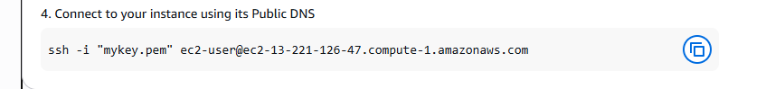
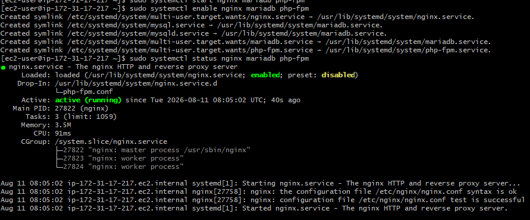
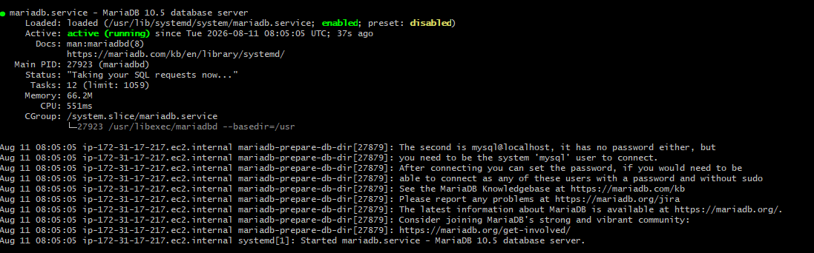
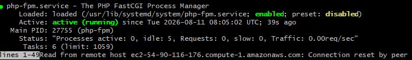
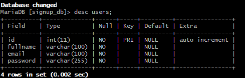
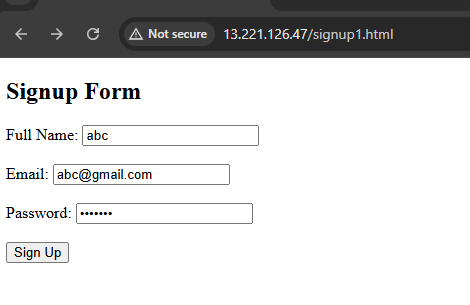
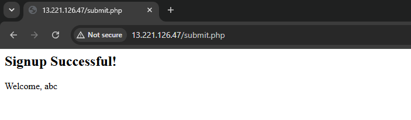
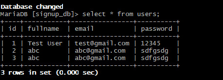

# AWS LEMP Dynamic PHP Signup Website

## 📌 Introduction

This project demonstrates the deployment of a **dynamic PHP website on
an AWS EC2 instance** using the **LEMP stack**.

LEMP stands for:

-   **L** → Linux
-   **E** → Nginx (Engine-X)
-   **M** → MySQL / MariaDB
-   **P** → PHP

The application contains a user signup form built using HTML. The form
data is processed by PHP and stored in a MariaDB database.

The complete deployment was performed on an AWS EC2 instance with Nginx
as the web server, PHP-FPM for PHP processing, and MariaDB as the
database server.

------------------------------------------------------------------------

## 🏗️ Project Architecture

``` text
                       User
                         |
                         ↓
                     Internet
                         |
                         ↓
                  AWS EC2 Instance
                  Linux / Amazon Linux
                         |
                         ↓
                       Nginx
                         |
                         ↓
                     PHP-FPM
                         |
                         ↓
                    PHP Backend
                         |
                         ↓
                   MySQL / MariaDB
                         |
                         ↓
                    signup_db
                         |
                         ↓
                      users
                       Table
```

------------------------------------------------------------------------

## 🛠️ Technologies Used

  Technology             Purpose
  ---------------------- ----------------------
  AWS EC2                Cloud server
  Amazon Linux / Linux   Operating system
  Nginx                  Web server
  PHP                    Backend
  PHP-FPM                PHP processing
  MariaDB                Database
  HTML/CSS               Frontend
  SSH                    Remote server access

------------------------------------------------------------------------

## ✨ Features

-   User signup form
-   Dynamic PHP backend
-   MariaDB database
-   Nginx web server
-   PHP-FPM
-   AWS EC2 deployment
-   Linux server configuration
-   Database connectivity
-   Form submission and response

------------------------------------------------------------------------

## 📂 Project Structure

``` text
aws-lemp-dynamic-website/
│
├── signup.html
├── submit.php
├── README.md
│
└── screenshots/
    ├── ec1.png
    ├── ec2.png
    ├── ssh.png
    ├── server1.png
    ├── server2.png
    ├── server3.png
    ├── datatable.png
    ├── form.png
    ├── signin.png
    └── database.png
```

> **Important:** The screenshot files are stored inside the
> `screenshots/` folder and referenced using relative Markdown paths.
> Therefore, when this project is pushed to GitHub, the images will
> render directly in the README.

------------------------------------------------------------------------

# 🚀 Deployment Steps

## 1. Launch EC2

Create an Amazon Linux EC2 instance and configure the required Security
Group rules.

### EC2 launch confirmation


### Running EC2 instance


The EC2 instance shown in the deployment is running successfully and has
passed its status checks.

------------------------------------------------------------------------

## 2. Connect Using SSH

Connect to the EC2 instance using the private key:

``` bash
ssh -i "your-key.pem" ec2-user@YOUR_PUBLIC_IP
```

### SSH connection



> Never upload your `.pem` private key to GitHub.

Add this to `.gitignore`:

``` gitignore
*.pem
.env
```

------------------------------------------------------------------------

## 3. Update the Server

Update installed packages:

``` bash
sudo dnf update -y
```

Depending on the Amazon Linux version, the package manager may differ.

------------------------------------------------------------------------

## 4. Install LEMP Components

Install the required components:

``` bash
sudo dnf install nginx mariadb105-server php php-fpm -y
```

Package names can vary depending on the Amazon Linux version.

The required stack is:

``` text
Nginx
MariaDB
PHP
PHP-FPM
```

------------------------------------------------------------------------

## 5. Start Services

Start the required services:

``` bash
sudo systemctl start nginx
sudo systemctl start mariadb
sudo systemctl start php-fpm
```

------------------------------------------------------------------------

## 6. Enable Services

Enable services so they start automatically after reboot:

``` bash
sudo systemctl enable nginx
sudo systemctl enable mariadb
sudo systemctl enable php-fpm
```

------------------------------------------------------------------------

# 🔍 Server Status

The following screenshots document the running services.

## Nginx



Nginx is shown as **active (running)** and its configuration test is
successful.

------------------------------------------------------------------------

## MariaDB



MariaDB is shown as **active (running)** and is responsible for storing
the signup records.

------------------------------------------------------------------------

## PHP-FPM



PHP-FPM is shown as **active (running)** and processes PHP requests
received from Nginx.

------------------------------------------------------------------------

## Check All Services

Run:

``` bash
sudo systemctl status nginx
sudo systemctl status mariadb
sudo systemctl status php-fpm
```

Expected state:

``` text
active (running)
```

------------------------------------------------------------------------

# 🗄️ Database Configuration

The application uses the MariaDB database:

``` text
signup_db
```

and the table:

``` text
users
```

## 1. Create Database

``` sql
CREATE DATABASE signup_db;
```

## 2. Select Database

``` sql
USE signup_db;
```

## 3. Create Users Table

The table structure used by the application is:

``` sql
CREATE TABLE users (
    id INT AUTO_INCREMENT PRIMARY KEY,
    fullname VARCHAR(100) NOT NULL,
    email VARCHAR(100) NOT NULL,
    password VARCHAR(255) NOT NULL
);
```

## 4. Check the Table

``` sql
DESC users;
```

### Users table structure



The screenshot confirms the table contains:

-   `id`
-   `fullname`
-   `email`
-   `password`

The `id` column is the primary key and uses `AUTO_INCREMENT`.

------------------------------------------------------------------------

# 🔄 Application Flow

``` text
                     User
                       |
                       ↓
                  signup.html
                       |
                       ↓
                  Submit Form
                       |
                       ↓
                   submit.php
                       |
                       ↓
                    PHP-FPM
                       |
                       ↓
                 MySQL / MariaDB
                       |
                       ↓
                   signup_db
                       |
                       ↓
                    users Table
```

------------------------------------------------------------------------

# 📝 Signup Form

The application provides a simple signup form.



The form contains:

-   Full Name
-   Email
-   Password
-   Sign Up button

Example URL:

``` text
http://YOUR_PUBLIC_IP/signup.html
```

------------------------------------------------------------------------

# ✅ Signup Response

After submitting the form, the PHP backend processes the request and
returns a successful signup response.



The screenshot shows:

``` text
Signup Successful!

Welcome, abc
```

This confirms that the PHP endpoint is reachable and successfully
processes the submitted signup request.

------------------------------------------------------------------------

# 🧪 Testing

The website can be accessed using the EC2 public IP:

``` text
http://YOUR_PUBLIC_IP/signup.html
```

After submitting the form, connect to MariaDB and verify the stored
records.

``` sql
USE signup_db;

SELECT id, fullname, email
FROM users;
```

### Database records



The screenshot confirms that signup records have been inserted into the
`users` table.

------------------------------------------------------------------------

# 🔐 Security Notes

The screenshots show this project working as a basic proof of concept.
Before using the application in production, the following improvements
should be made.

## Password Hashing

Passwords should **never be stored as plaintext**.

Use PHP:

``` php
$passwordHash = password_hash(
    $_POST['password'],
    PASSWORD_DEFAULT
);
```

For login:

``` php
password_verify($password, $passwordHash);
```

## Prepared Statements

Use PDO prepared statements instead of directly inserting user input
into SQL queries.

``` php
$stmt = $pdo->prepare(
    "INSERT INTO users (fullname, email, password)
     VALUES (:fullname, :email, :password)"
);
```

## HTTPS

The current screenshot uses HTTP and the browser displays:

``` text
Not secure
```

For production:

``` text
HTTP
 ↓
HTTPS
```

Configure a domain and TLS/SSL certificate and redirect HTTP traffic to
HTTPS.

## Database User

Do not use the MariaDB root account from the PHP application.

Create a dedicated database user with only the required permissions.

## Secrets

Never commit:

``` text
.env
*.pem
database passwords
AWS credentials
```

to GitHub.

------------------------------------------------------------------------

# 📸 Screenshots

All deployment screenshots are stored in the `screenshots/` directory.

## EC2 Launch


## EC2 Running Instance


## SSH Connection


## Nginx Status


## MariaDB Status


## PHP-FPM Status


## Database Table Structure


## Signup Form


## Signup Success


## Database Records


------------------------------------------------------------------------

# 📚 What I Learned

Through this project, I gained practical experience in:

-   Launching and managing AWS EC2 instances
-   Connecting to Linux servers using SSH
-   Linux server administration
-   Installing and configuring Nginx
-   PHP-FPM configuration
-   MariaDB database management
-   PHP and database connectivity
-   HTML form creation
-   PHP form processing
-   Deploying a dynamic website to AWS EC2
-   Checking server services with `systemctl`
-   Verifying database records
-   Managing a cloud-hosted application

------------------------------------------------------------------------

# 🔮 Future Improvements

The project can be extended with:

-   User login
-   Password hashing
-   Form validation
-   Duplicate email validation
-   HTTPS using SSL/TLS
-   Custom domain name
-   User dashboard
-   Logout/session management
-   Database backups
-   AWS monitoring
-   CI/CD deployment
-   Better UI using CSS/Bootstrap
-   Production error handling

------------------------------------------------------------------------

# 🎯 Conclusion


This project successfully demonstrates the deployment of a dynamic PHP website on an AWS EC2 instance using the LEMP stack. The application was configured with Nginx as the web server, PHP-FPM for processing PHP requests, and MariaDB for storing user data.

Through this project, I gained practical experience in AWS EC2, Linux server administration, Nginx, PHP, MariaDB, security groups, and cloud-based website deployment. It also helped me understand how the frontend, backend, web server, and database work together in a real-world cloud environment.
Overall, this project provided hands-on experience in cloud deployment and DevOps fundamentals.

